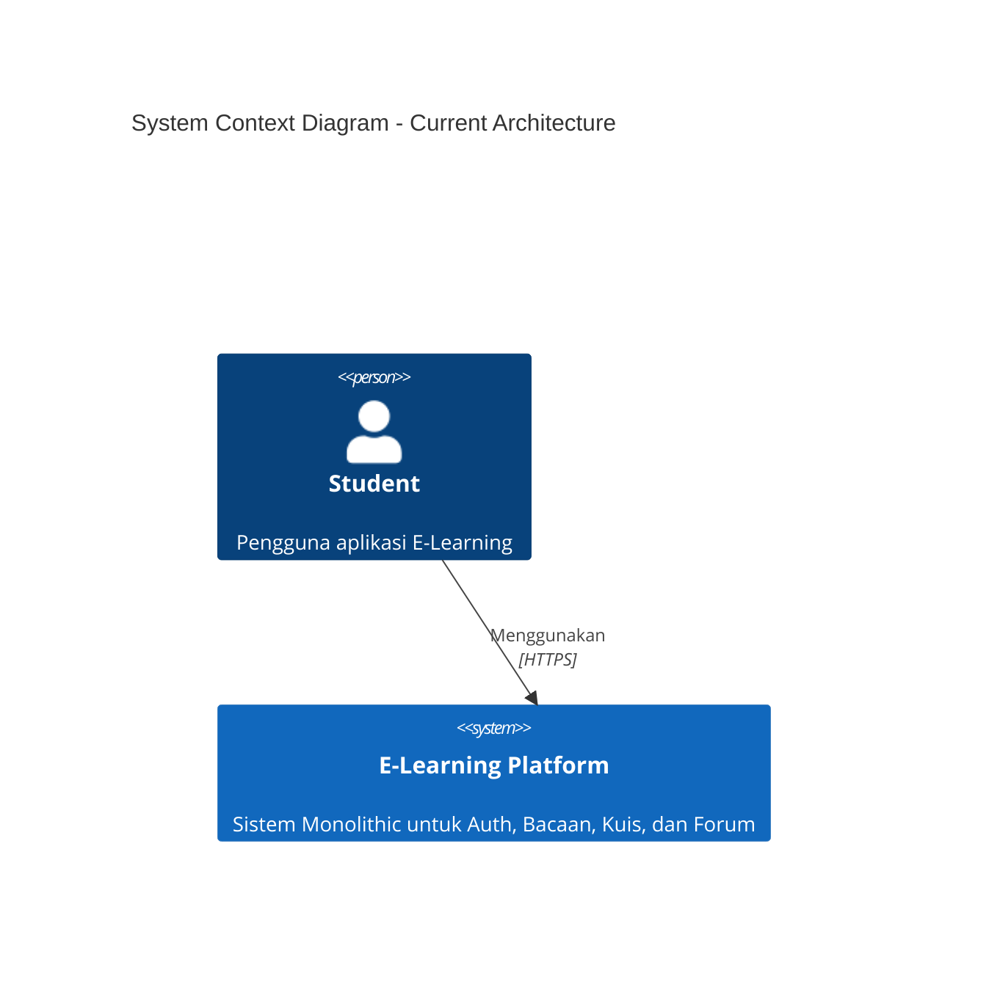
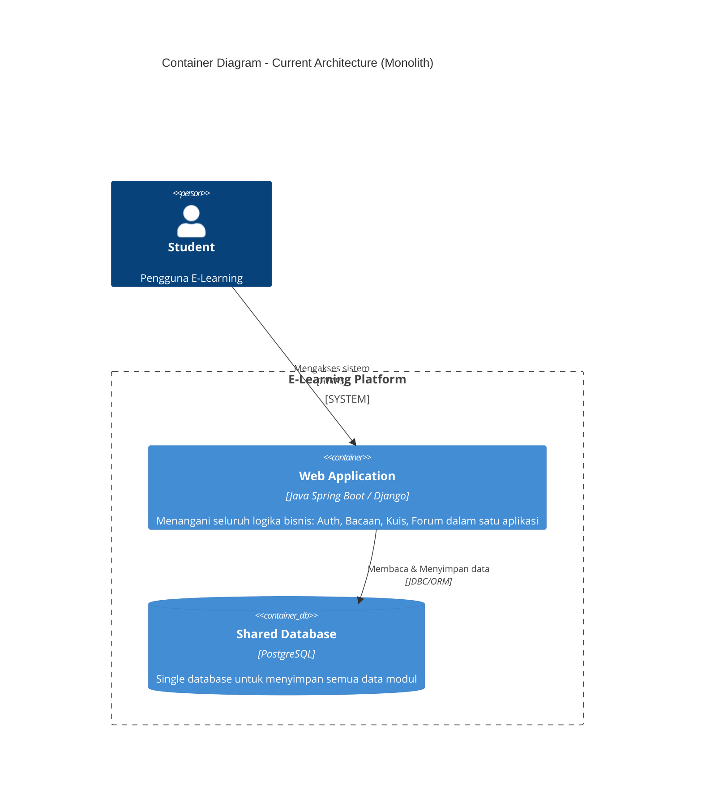
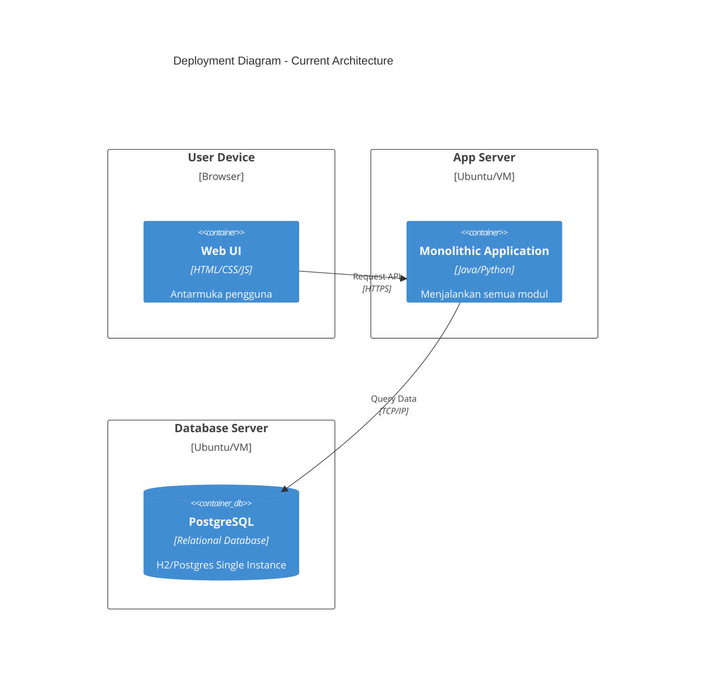

# Module-09

### 1. Current Architecture Diagrams

**Context Diagram**

**Container Diagram**

**Deployment Diagram**

1. The current architecture of the group: Monolithic
2. The future architecture of the group : Microservice
3.  Explanation of risk storming of the group:
## Critical Risks at Scale (1M DAU)

### Risk : Database Scalability Bottleneck 

**Scenario:** Peak hours with 100K concurrent users

#### Current Architecture
- Single H2/PostgreSQL database instance
- All modules (auth, bacaan, kuis, forum) share one database
- No read replicas or sharding strategy
- Auto-increment primary keys create hotspots

#### Risk Statement
> "If user adoption reaches 1M DAU, database becomes the primary bottleneck, causing 5-10 second query latencies and 30-40% service unavailability during peak hours."

#### Manifestations
1. **Connection Pool Exhaustion**
2. **Lock Contention**
3. **Query Performance Degradation**

Alasan memakai risk storming:
1. Identifikasi Risiko Awal dalam Development
   Diperlukan cara cepat untuk mengidentifikasi potensi masalah sebelum mereka menjadi kritis
   Risk Storming memungkinkan tim untuk berdiskusi dan mengidentifikasi risiko secara kolaboratif.

2. Fokus pada Arsitektur
   Risk Storming khusus dirancang untuk menganalisis risiko yang terkait dengan keputusan arsitektur, sehingga kami dapat mengevaluasi keputusan arsitektur tersebut.

3. Identifikasi Risiko Spesifik
   Risk Storming membantu mengidentifikasi risiko di area-area penting.

4. Scalability & Maintainability
   Proyek akan terus berkembang dengan fitur baru, dan
   Risk Storming membntu memahami trade-offs dari keputusan desain saat ini, sehingga
   memandu refctoring dan architectural improvements di masa depan.

